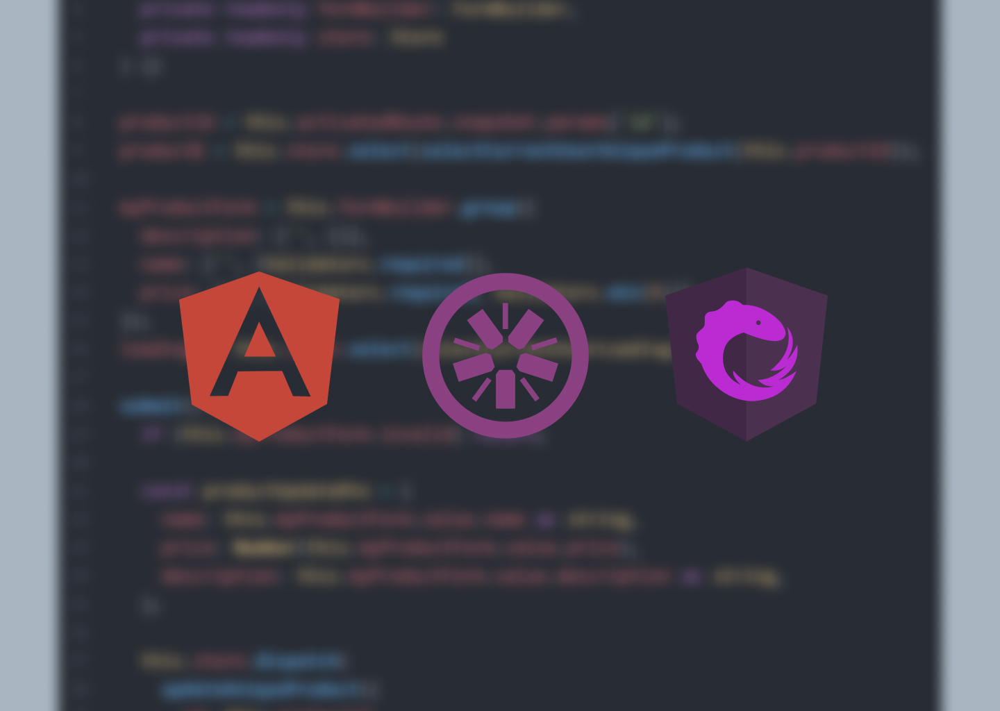

# Frontend para cadastro de usuários e produtos
<h4>Consumindo meu próprio backend: <a href="https://github.com/GabrielCoutz/nestjs-prisma-api">NestJS API com Prisma</a> </h4>

  

## Tópicos

 • <a href="#sobre">📋 Sobre o Projeto</a>  
 • <a href="#tecnologias">🔮 Tecnologias</a>  
 • <a href="#funcionalidades">🛠 Funcionalidades</a>  
 • <a href="#demonstração">🎥 Demonstração</a>  
 • <a href="#autor">😎 Autor</a>  

---

<h2 id="sobre">📋 Sobre o projeto</h2>

Este projeto tem como intenção o aprofundamento em Angular, conhecimento e prática do NgRx e aumentar o domínio do Angular Material

Além disso, faz-se presente o consumo da minha própria API, disponível em um container Docker, no qual é feita a total integração

Não é possível replicar o projeto com o container docker, **ainda**, porém a API está disponível em: <a href="https://github.com/GabrielCoutz/nestjs-prisma-api">github.com/GabrielCoutz/nestjs-prisma-api</a>

---

<h2 id="tecnologias">🔮 Tecnologias</h2>

    

---

<h2 id="funcionalidades">🛠 Funcionalidades</h2>

**Autenticação**

:white_check_mark: Auto Login

:white_check_mark: Route Guards

:white_check_mark: Autenticação em ações

**Estrutura**

:white_check_mark: Componentes puros (Apenas consomem dados, não alteram estados)

**Plus**

:white_check_mark: Todos estados e efeitos são gerenciados pelo NgRx

:white_check_mark: Modelo <a href="https://www.atlassian.com/br/git/tutorials/comparing-workflows/gitflow-workflow">Gitflow</a> utilizado

:white_check_mark: Feedback em todas ações realizadas (loading, error, alert...)

---

<h2 id="demonstração">📷 Demonstração</h2>

---

<h2 id="author">😎 Entre em contato</h2>

 

  Desenvolvido por <strong>eu mesmo😊</strong>

